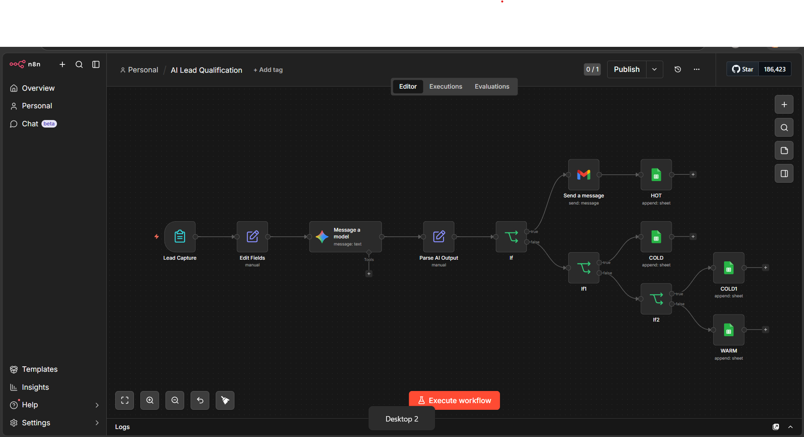

# N8N-Lead-Qualification

# AI Lead Qualification Automation (n8n)

## Overview

Built an AI-powered lead qualification system that automatically classifies incoming leads into HOT, WARM, and COLD categories using LLM-based analysis and rule-based decision logic.

## Workflow Preview

### Full Workflow

### AI Output Parsing

### Lead Classification Logic

## Problem

Businesses waste time manually filtering leads, leading to slow response times and missed high-value opportunities.

## Solution

Developed an automated workflow that:

- Captures lead data via form submission
- Uses AI (LLM) to analyze intent, budget, urgency, and maturity
- Parses structured JSON output
- Applies decision logic to classify leads
- Routes leads to appropriate pipelines (HOT, WARM, COLD)
- Sends alerts for high-priority leads

## Tech Stack

## 🔐 Environment Setup

1. Copy `.env.example` to `.env`
2. Fill in your API keys and credentials
3. Configure credentials inside n8n:

   * Google Sheets OAuth
   * Gmail OAuth
   * Gemini/OpenAI API key

⚠️ Do NOT commit your `.env` file to GitHub.

## Workflow Logic

1. Lead data captured from form
2. AI analyzes and returns structured JSON:
   - intent
   - budget_value
   - urgency
   - lead_score
   - confidence

3. Decision engine:
   - COLD: low score or unclear + low budget
   - HOT: high score + high urgency + strong confidence
   - WARM: remaining leads

## Features

- Automated lead scoring
- AI-based intent detection
- Real-time classification
- Multi-branch workflow routing
- Scalable decision logic

## Output

- HOT → Immediate notification + Sheet
- WARM → Nurture pipeline
- COLD → Low-priority storage

## How to Use

1. Import workflow into n8n
2. Add API credentials (Google, LLM)
3. Connect Google Sheets
4. Run workflow

## Future Improvements

- CRM integration (HubSpot / Salesforce)
- Automated follow-up sequences
- Dashboard for lead analytics
- Dynamic scoring model

## Author

Madhav Sai Chinthaginjala
